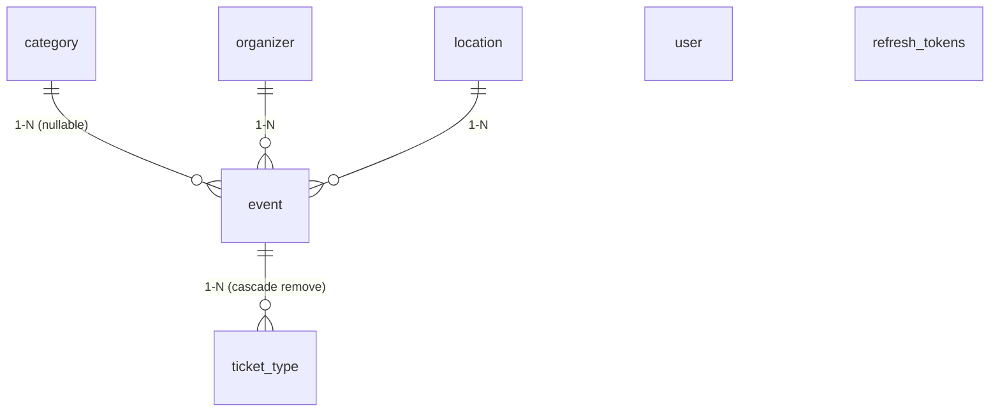

# Structure de la base de données

Cette documentation décrit le schéma de la base TicketUp tel qu'il découle **des entités Doctrine** (`src/Entity/`).

> **Les entités sont la seule source de vérité.** La migration `migrations/Version20260108164208.php` a un `up()` vide, et `src/sql/main.sql` est un brouillon de schéma antérieur qui ne correspond plus au modèle (il contient par exemple une table `app_user` et une relation `organizer.user_id` qui n'existent pas dans le code).

## Vue d'ensemble

7 tables, dont les noms sont générés par la stratégie de nommage Doctrine `underscore_number_aware` (configurée dans `config/packages/doctrine.yaml`).



```
                 ┌────────────┐
                 │  category  │
                 └─────┬──────┘
                       │ 1
                       │
                       │ N            ┌─────────────┐
┌────────────┐   ┌─────┴──────┐  N  1 │  organizer  │
│ticket_type │ N │            ├───────┤             │
│            ├───┤   event    │       └─────────────┘
└────────────┘ 1 │            │  N  1 ┌─────────────┐
                 └────────────┴───────┤  location   │
                                      └─────────────┘

┌────────────┐        ┌──────────────────┐
│   "user"   │        │  refresh_tokens  │   ← aucune FK entre les deux
└────────────┘        └──────────────────┘      (lien logique par email)
```

`event` est la table centrale. **`user` et `refresh_tokens` sont totalement isolés** : aucune clé étrangère ne les relie au reste du modèle.

## Détail des tables

### `event` — `src/Entity/Event.php`

| Colonne | Type | Contrainte |
|---|---|---|
| `id` | INT identity | PK |
| `title` | VARCHAR(150) | NOT NULL |
| `description` | TEXT | NOT NULL |
| `started_at` | TIMESTAMP | NOT NULL |
| `end_at` | TIMESTAMP | NOT NULL |
| `image_url` | TEXT sérialisé | NOT NULL, `Types::ARRAY` |
| `created_at` | TIMESTAMP | NOT NULL |
| `updated_at` | TIMESTAMP | NOT NULL |
| `status` | BOOLEAN | NOT NULL, `false` à la création |
| `category_id` | INT | FK → `category`, **nullable** |
| `organizer_id` | INT | FK → `organizer`, NOT NULL |
| `location_id` | INT | FK → `location`, NOT NULL |

Les trois relations `ManyToOne` sont en `cascade: ['persist']` — c'est ce qui permet à `EventInputDenormalizer` de créer une catégorie, un organisateur ou un lieu à la volée depuis le payload de `POST /api/events`.

`status` sert de filtre de publication : `EventRepository::findByCategory()` et `EventRepository::searchEvents()` ne renvoient que `status = true`, alors que `GetEventsController` (liste générale) ne filtre pas — les événements non publiés y apparaissent donc.

Les timestamps sont posés dans le **constructeur** de l'entité (pas via des lifecycle callbacks) : `updatedAt` n'est donc pas rafraîchi automatiquement lors d'une mise à jour.

### `ticket_type` — `src/Entity/TicketType.php`

| Colonne | Type | Contrainte |
|---|---|---|
| `id` | INT identity | PK |
| `name` | VARCHAR(50) | NOT NULL |
| `prix` | INT | NOT NULL |
| `quantite_max` | INT | NOT NULL |
| `created_at` | TIMESTAMP | NOT NULL |
| `updated_at` | TIMESTAMP | NOT NULL |
| `event_id` | INT | FK → `event`, NOT NULL |

Côté `Event`, la collection est en `orphanRemoval: true` + `cascade: ['persist', 'remove']` : supprimer un événement supprime ses types de billets, et retirer un `TicketType` de la collection le supprime en base.

### `category` — `src/Entity/Category.php`

| Colonne | Type | Contrainte |
|---|---|---|
| `id` | INT identity | PK |
| `name` | VARCHAR(100) | NOT NULL |
| `color` | VARCHAR(50) | NOT NULL |
| `created_at` | TIMESTAMP | NOT NULL |
| `updated_at` | TIMESTAMP | NOT NULL |

### `organizer` — `src/Entity/Organizer.php`

| Colonne | Type | Contrainte |
|---|---|---|
| `id` | INT identity | PK |
| `name` | VARCHAR(100) | NOT NULL |
| `email` | VARCHAR(100) | NOT NULL |
| `phone` | VARCHAR(50) | nullable |
| `website` | VARCHAR(100) | nullable |
| `created_at` | TIMESTAMP | NOT NULL |
| `updated_at` | TIMESTAMP | NOT NULL |

### `location` — `src/Entity/Location.php`

| Colonne | Type | Contrainte |
|---|---|---|
| `id` | INT identity | PK |
| `name` | VARCHAR(100) | NOT NULL |
| `size` | INT | NOT NULL (capacité du lieu) |
| `created_at` | TIMESTAMP | NOT NULL |
| `updated_at` | TIMESTAMP | NOT NULL |

### `"user"` — `src/Entity/User.php`

Le nom de table est explicitement entre guillemets (`#[ORM\Table(name: '`user`')]`) car `user` est un mot réservé PostgreSQL.

| Colonne | Type | Contrainte |
|---|---|---|
| `id` | INT identity | PK |
| `email` | VARCHAR(180) | NOT NULL, index unique `UNIQ_IDENTIFIER_EMAIL` |
| `roles` | JSON | NOT NULL |
| `password` | VARCHAR | NOT NULL (hash) |
| `firstname` | VARCHAR(50) | NOT NULL |
| `lastname` | VARCHAR(50) | NOT NULL |
| `phone` | VARCHAR(30) | nullable |
| `language` | VARCHAR(10) | nullable, `'fr'` par défaut |
| `is_active` | DATETIME | nullable — « date d'activation » |
| `created_at` | TIMESTAMP | NOT NULL |
| `updated_at` | TIMESTAMP | NOT NULL |

Contrairement aux autres entités, `User` utilise des lifecycle callbacks (`#[ORM\HasLifecycleCallbacks]`, `onPrePersist` / `onPreUpdate`) : `updated_at` y est donc bien maintenu à jour, et `language` reçoit sa valeur par défaut à l'insertion. `setEmail()` normalise l'email en minuscules et le trim.

`getRoles()` ajoute toujours `ROLE_USER` à la lecture ; ce rôle n'est pas forcément stocké en base.

### `refresh_tokens` — `src/Entity/RefreshToken.php`

Entité héritée du bundle Gesdinet (`gesdinet/jwt-refresh-token-bundle`), simplement remappée sur la table `refresh_tokens`.

| Colonne | Type | Contrainte |
|---|---|---|
| `id` | INT identity | PK |
| `refresh_token` | VARCHAR | unique |
| `username` | VARCHAR | NOT NULL |
| `valid` | DATETIME | NOT NULL |

Le lien vers l'utilisateur est **le champ `username` qui contient l'email**, pas une clé étrangère — comportement configuré par `user_identity_field: email` dans `config/packages/gesdinet_jwt_refresh_token.yaml`. Les tokens ont une durée de vie de 30 jours et sont en rotation `single_use`.

## Points à connaître avant de modifier le schéma

1. **Aucune migration exploitable.** `Version20260108164208.php` a un `up()` vide : la base n'est pas reconstructible depuis `migrations/`. Toute évolution du schéma devrait passer par un vrai `php bin/console doctrine:migrations:diff`.

2. **`organizer` n'est relié à aucun `user`.** Un organisateur est aujourd'hui une simple fiche de contact ; rien n'indique quel compte l'a créé. C'est le sujet de la branche distante `fix/conflit-relation-user-organizer`.

3. **`image_url` en `Types::ARRAY`** = tableau PHP passé à `serialize()` dans une colonne texte. Non requêtable, illisible depuis un autre langage, et le type est déprécié. `Types::JSON` en serait le remplaçant naturel.

4. **`orphanRemoval: true` sur `Organizer::$events` et `Location::$events`**, combiné à une FK `NOT NULL` : retirer un événement de la collection d'un organisateur le **supprime** de la base. Sur `Category::$events` (pas d'`orphanRemoval`, FK nullable) le comportement est inverse — `category_id` passe à `NULL`. Les trois relations se ressemblent mais ne se comportent pas pareil.

5. **`prix` est un INT** : ni décimales, ni devise stockée.

6. **`is_active` est une date, pas un booléen**, malgré son nom. `NULL` signifie « jamais activé ».

7. **Toute la partie transactionnelle manque.** `ticket_type` ne décrit que l'offre (`quantite_max`) ; il n'existe ni table de billets vendus, ni commande, ni paiement. C'est pourquoi `AdminEventDetailsController` renvoie un `statusTicket` dont les clés « global », « actuel » et « filter » contiennent toutes la même valeur : il n'y a rien à décrémenter.

## Commandes utiles

```bash
php bin/console doctrine:mapping:info          # liste des entités mappées
php bin/console doctrine:schema:update --dump-sql   # SQL que Doctrine appliquerait
php bin/console doctrine:migrations:diff       # générer une migration depuis les entités
php bin/console dbal:run-sql "\\d event"        # inspecter une table
```
